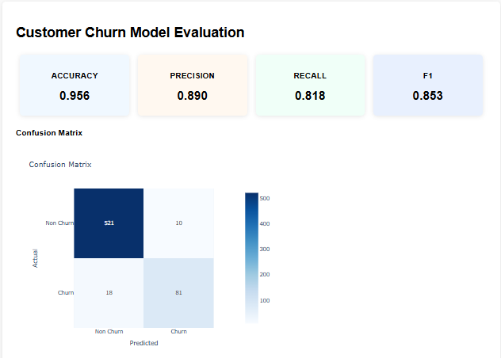

# Customer Churn Prediction (XGBoost + ZenML)

 

A production-ready MLOps pipeline for predicting customer churn using XGBoost.

   
    
   
  
<em>ZenML visualization of the training pipeline DAG</em>

This project aims to **predict customer churn** using a machine learning pipeline built with **XGBoost** and **ZenML**. It includes data preprocessing, model training, evaluation, and visualization of feature importance and model performance.

---

## 📊 Data Overview

This project uses the [Iranian Churn dataset](https://archive.ics.uci.edu/dataset/563/iranian+churn+dataset) from the UCI Machine Learning Repository.

## 🚀 Project Highlights

- 🔍 Data Cleaning and Feature Engineering
- 📈 Predictive Modeling using `XGBoostClassifier`
- 📊 Visual Evaluation: Confusion Matrix, Feature Importances
- ⚙️ MLOps-Ready with [ZenML](https://zenml.io/)
- 📦 Modular pipeline for reproducibility and scalability

---

## 🧠 Problem Statement

**Customer churn** is a major concern for businesses — retaining customers is often more cost-effective than acquiring new ones. This project helps to:
- Identify customers likely to churn.
- Understand drivers of churn using feature importance.

---

## 🚀 Pipeline Architecture

The project implements a complete ML pipeline with the following steps:

1. **Data Loading**: load the customer churn dataset
2. **Data Cleaning**: Drop unnecessary columns, Map binary/ordinal to categorical values
3. **Data Preprocessing**: Handle skewness, Min-Max Scaling, Process categorical variables
4. **Data Splitting**: Split data into training and test sets
5. **Model Training**: Train an XGBoost classifier
6. **Model Evaluation**: Evaluate model performance and visualize results with interactive HTML visualization

   
    
   
  
<em>ZenML visualization of the evals</em>

